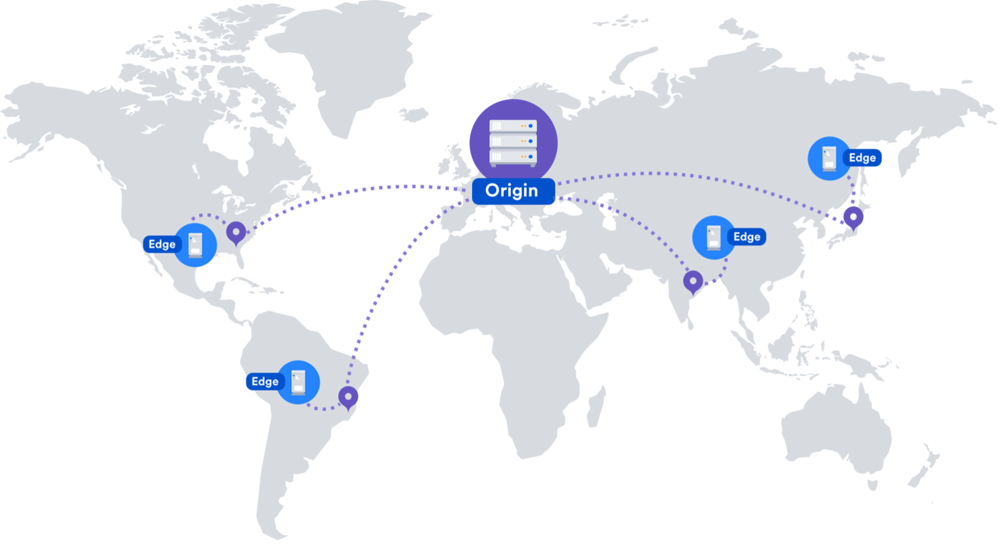
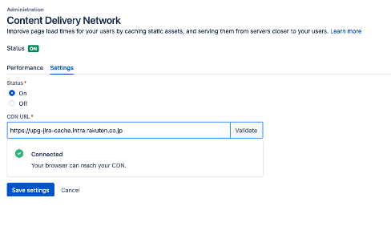
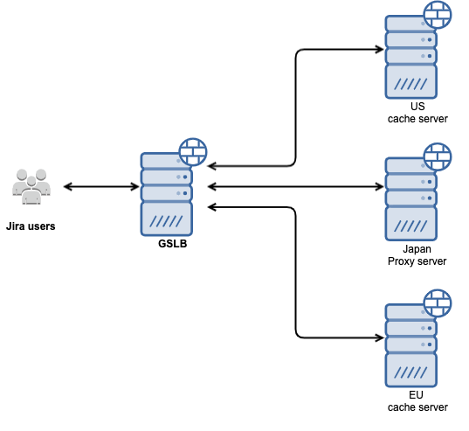
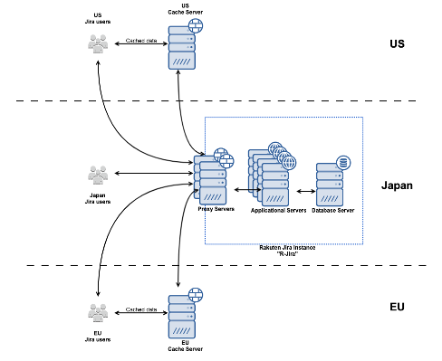
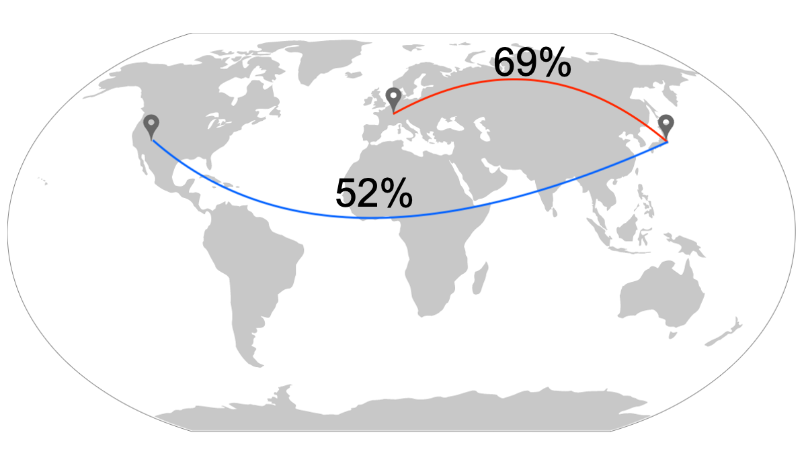

Atlassian recently introduced Content Delivery Networks (CDN) support to their products, namely Jira from version 8.3 onwards. This support includes common CDNs like AWS CloudFront, Cloudflare, Akamai, and others[^atl2019]. However, there is no clear documentation on how to use the feature using self-hosted cache servers instead of a publicly available CDN. In this article, we go through the procedure of implementing Jira cache servers in other geographic locations and enabling them in Jira using the CDN feature. We were able to configure an on-premises approach using a couple of Apache cache servers in remote locations (Germany and USA) connected to a Jira instance located in Japan. In the end, we concluded there was an improvement of about 69% to the European region and 52% to the Americas region using our approach.

# INTRODUCTION
We at Rakuten manage a Jira instance that consists of thousands of users, mainly located in Japan, however many users are in other remote offices around the world, namely in the European region and North America. These users, while still needing to use the same instance were limited to worse access times than their colleagues in Japan. Until recently Jira did not support multiple geographies distribution, Atlassian introduced support for Content Delivery Networks (CDN) to their products, specifically Jira from version 8.3 onwards. This support includes common CDNs like AWS CloudFront, Cloudflare, Akamai, and others[^atl2019]. This solution would allow us to cache data closer to users, therefore, improving their user experience by reducing the access times, but since we have some concerns about using a public CDN we ideally wanted to implement our caching solution, which was a challenge since it’s not clearly supported by Atlassian and there are not many documented approaches available. In this article, we will explain how we could achieve said implementation and present our results.

# BACKGROUND
Rakuten’s Jira instance (R-Jira) consists of a series of application servers running the Jira product itself, one database server that is connected to those, which are in their turn connected to a couple of redundant reverse proxy servers (see Figure 1). User requests arrive at the reverse proxy and are then forwarded to the application servers. 

|")|
|:--:|
|<b>FIGURE 1 - RAKUTEN JIRA INSTANCE (R-JIRA)</b>|

As for Jira’s CDN support, when enabled, static assets (such as JavaScript, CSS, and fonts) are cached on edge servers provided by a CDN vendor that are geographically closer to the user[^atl2019]. Jira does this by redirecting traffic to the cached assets to another URL, which is configured manually in the UI (example: jira-cache.example.com).

||
|:--:|
|<b>FIGURE 2 - JIRA'S CDN DIAGRAM [Atlassian, 2019](https://confluence.atlassian.com/adminjiraserver/use-a-cdn-with-atlassian-data-center-applications-974378840.html)</b>|

In order to enable support, there are a few requirements[^atl2019-2]:

* HTTP2 needs to be enabled in the reverse proxy from Figure 1, as it is required by Jira to use CDN.
* Edge servers need to be installed with a web server like Apache to work as a caching server.
* Global Server Load Balancing (GSLB) needs to be set up on the network to route traffic based on geographic location.
* Domain Name Server (DNS) entries need to be added for the cache servers (example: jira-cache.example.com).
* All the cache servers need to use the same name as above, GSLB will be responsible to direct the traffic to each one according to the user’s location.

# SOLUTION

To implement the previously described requirements we did the following:

- Jira’s certificate was updated to include the CDN URL.
- Ubuntu servers running Apache for caching the data[^atl2021].
  - The modules mod_cache_disk and mod_http2 needed to be enabled in Apache. 
  - A reverse proxy to the main Jira URL needs to be configured as well, otherwise not yet cached assets cannot be accessed while using the cache server. However, this was done only for [Jira URL]/s since only that path is used by the CDN feature. Traffic to other paths was blocked for security.
  - HTTP2 was enabled.
  - Cache was enabled and a cached data path configured.
- Certificates were added, these must be the same certificate as in the main Jira instance.
- GSLB was configured in the network using F5, this configuration will send the traffic to the server IP address closest to the user.
- HTTP2 was enabled in the reverse proxies’ Haproxy configuration.
- DNS entries were added for the CDN URL (which is a URL for our Apache servers).
- Jira was configured in the UI to use the URL (see Figure 3).

||
|:--:|
|<b>FIGURE 3 - JIRA'S CDN CONFIGURATION</b>|

However, we faced a challenge: since we only added a couple of servers, one in Germany and another one in the USA, we needed to make sure that when Jira redirected the traffic to the CDN URL (example: jira-cache.example.com), users located in Japan were not directed to the cache servers located in the other countries. To fix this we added the Japanese reverse proxy IP address to the GSLB configuration, this way the example URL jira-cache.example.com will also send the requests to Japan if the users are closer to that location, completely bypassing the cache servers we configured in that scenario.

||
|:--:|
|<b>FIGURE 4 - GSLB TRAFFIC DIAGRAM</b>|

# RESULTS
Figure 5 shows how the traffic appears in the browser’s web development tools, as displayed both domains for the main Jira URL (jira.example.com) and the CDN URL (jira-cache.example.com) can be seen as requests are made, static assets are requested to the CDN URL instead of the main Jira URL.

||
|:--:|
|<b>FIGURE 5 - NETWORK TRAFFIC WHEN USING CDN AS SEEN IN THE BROWSER</b>|

In Figure 6 a diagram representing how traffic is directed after enabling the CDN in Jira can be seen, users located in the US are directed to the US cache server to access the cached data (static assets), while other requests still go directly to Japan. The same goes for users in Europe.

||
|:--:|
|<b>FIGURE 6 - RAKUTEN JIRA INSTANCE WITH CACHE SERVERS ENABLED</b>|

Finally, in Figure 7 there is a representation of how the access times improved based on multiple access tests from remote locations. We measured an improvement of 69% from Europe and 52% from the US with our test data. 

||
|:--:|
| <b>FIGURE 7 - AVERAGE CDN IMPROVEMENT RESULTS BASED ON MULTIPLE ACCESS TESTS (Based on https://commons.wikimedia.org/wiki/File:BlankMap-World.svg)</b>|
# CONCLUSION
Our test result data gives us confidence there is a real improvement in the user experience for our colleagues outside Japan. The application now feels “snappier” and while still needing to scale according to the number of users, we only added a couple of low spec’d and relatively low-cost cache servers. The investment cost was worth it for the performance improvement. As a bonus, we do not need to subscribe to an external CDN product to make this work to our needs.
To add to that, new cache servers can be set up easily on new locations if necessary: we only need to add a new server, a GSLB update, and a certificate update (only if the certificate is not valid for that new one).

# FINAL THOUGHTS
Since finishing the development and testing of this approach presented here, we have enabled both the US and EU cache servers for our Jira production, which is now usable by all our Jira users. Since the results were good, we would like to continue working on this feature for other applications as well. We are now planning the same for Confluence and are sure to face new challenges we look forward to overcoming and hopefully come with results as good as the ones for Jira.

[^atl2019]: Atlassian. (2019, July 11). Use a CDN with Atlassian Data Center applications. Retrieved from Administering Jira applications Support: https://confluence.atlassian.com/adminjiraserver/use-a-cdn-with-atlassian-data-center-applications-974378840.html
[^atl2019-2]: Atlassian. (2019, July 11). Configure your CDN for Jira Data Center. Retrieved from Administering Jira applications Support: https://confluence.atlassian.com/adminjiraserver/configure-your-cdn-for-jira-data-center-974378841.html
[^atl2021]: Atlassian. (2021, March 29). How to configure Apache for caching and HTTP/2. Retrieved from Atlassian Support: https://confluence.atlassian.com/kb/how-to-configure-apache-for-caching-and-http-2-972332210.html
